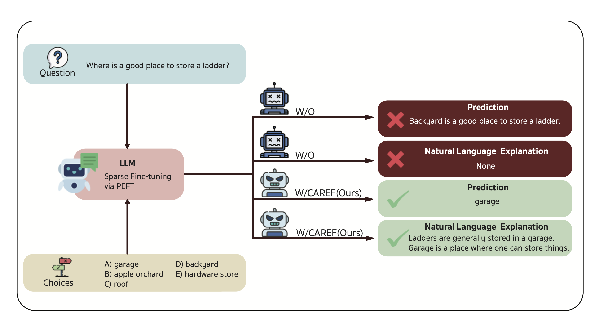
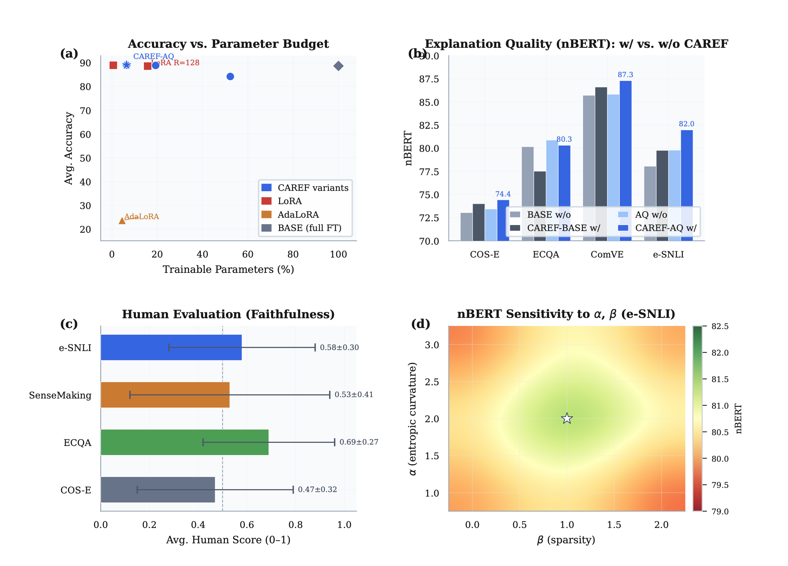
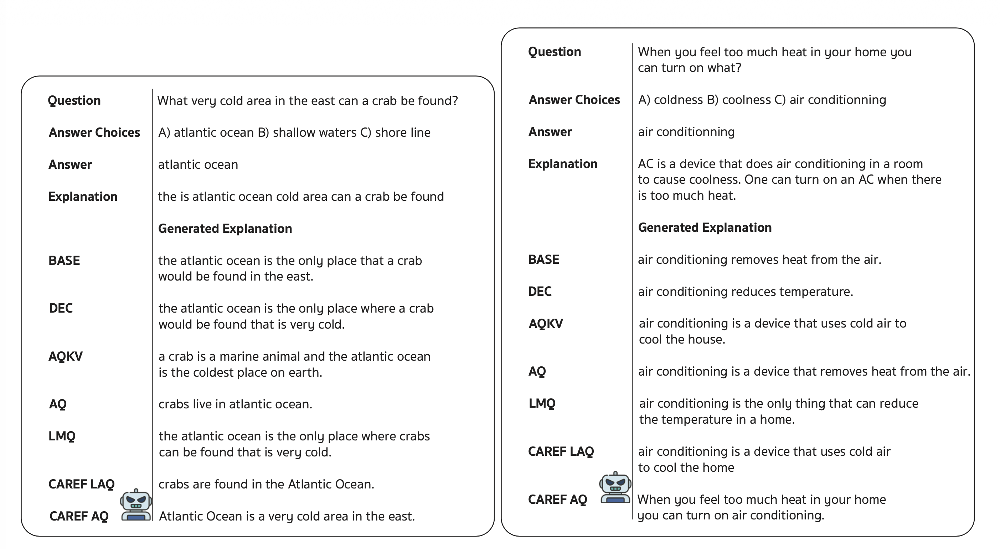

# CAREF: Calibration-Aware Regularization for Explanation Faithfulness Without Rationale Supervision

<div align="center">

# 🧠 CAREF

### Calibration-Aware Regularization for Explanation Faithfulness  
### Without Rationale Supervision

<br>

<strong>EMNLP 2026 Submission</strong>  
Currently under <strong>The ACL Rolling Review (ARR) — May 2026</strong>

<br><br>

<a href="https://kaopanboonyuen.github.io/CAREF/">

</a>

<a href="https://github.com/kaopanboonyuen/CAREF">

</a>


<br><br>

### ⚡ Parameter-Efficient Fine-Tuning for Faithful Natural Language Explanations

</div>

---

# 🌟 Overview

**CAREF** (**C**alibration-**A**ware **R**egularization for **E**xplanation **F**aithfulness) is a lightweight and explanation-oriented fine-tuning framework designed for generating more faithful natural language explanations from large language models.

Unlike conventional fine-tuning approaches that optimize only predictive performance, CAREF explicitly encourages:

- ✅ Better explanation grounding
- ✅ Stable confidence calibration
- ✅ Sparse decision-relevant reasoning
- ✅ Improved explanation alignment

without requiring expensive rationale annotations.

---

# 🚀 Highlights

- 🧠 Explanation-oriented PEFT framework
- ⚡ Only **6.43% trainable parameters**
- 📈 Improves explanation quality across multiple NLE benchmarks
- 🔍 Better explanation faithfulness without rationale supervision
- 🧩 Compatible with LoRA and PEFT pipelines
- 🌍 Architecture-agnostic design
- 📚 Evaluated on four commonsense reasoning datasets

---

# 🖼️ CAREF Overview

<p align="center">
  
</p>

<p align="center">
<b>CAREF overview:</b> parameter efficiency, explanation quality, human evaluation, and hyperparameter sensitivity analysis.
</p>

---

# 🧠 Motivation

Large Language Models can generate explanations that sound convincing.

However:

> plausible explanations are not always faithful explanations.

Most existing approaches either:

- require costly rationale annotations
- rely on post-hoc interpretation
- optimize fluency instead of causal grounding

CAREF addresses this challenge by encouraging models to focus on sparse and decision-relevant reasoning patterns during fine-tuning.

---

# ⚙️ Method

CAREF introduces a calibration-aware training strategy that jointly improves:

| Objective | Purpose |
|---|---|
| Predictive Learning | Preserve downstream task accuracy |
| Calibration Regularization | Reduce unstable overconfidence |
| Sparse Token Control | Encourage concise reasoning |
| Explanation Alignment | Improve faithfulness of generated explanations |

Instead of relying on rationale supervision, CAREF regularizes the predictive behavior of the model directly during optimization.

---

# 🔥 Why CAREF Works

CAREF encourages models to:

- focus on relevant reasoning tokens
- avoid diffuse explanation patterns
- reduce overconfident predictions
- generate more grounded explanations

This leads to stronger explanation quality while maintaining high predictive performance.

---

# 📊 Main Results

<p align="center">
  
</p>

---

# 🏆 Performance Summary

| Model | Avg Accuracy | Avg nBERT | Trainable Params |
|---|---:|---:|---:|
| AdaLoRA | 23.59 | 19.75 | 4.46% |
| LoRA R=128 | 88.57 | 80.58 | 15.74% |
| LoRA R=4 | 88.92 | 80.91 | 0.58% |
| **CAREF-AQ** | **89.04** | **81.00** | **6.43%** |

---

# 🧪 Benchmarks

We evaluate CAREF on four Natural Language Explanation benchmarks:

| Dataset | Task |
|---|---|
| COS-E | Commonsense QA + Explanations |
| ECQA | Explainable Commonsense QA |
| ComVE | Commonsense Validation |
| e-SNLI | Natural Language Inference |

---

# 👀 Qualitative Examples

<p align="center">
  
</p>

<p align="center">
<b>CAREF generates grounded and faithful explanations while baseline models fail to justify predictions.</b>
</p>

---

# 📈 Human Evaluation

CAREF consistently improves human-perceived explanation faithfulness.

| Dataset | Human Score |
|---|---:|
| ECQA | 0.69 |
| e-SNLI | 0.58 |
| SenseMaking | 0.53 |
| COS-E | 0.47 |

Key observations:

- CAREF produces more causally grounded explanations
- explanation quality improves without rationale labels
- sparse PEFT adaptation improves reasoning consistency

---

# 🧩 CAREF Variants

| Variant | Updated Module | Parameter Budget |
|---|---|---:|
| CAREF-BASE | Full Fine-Tuning | 100% |
| CAREF-DEC | Decoder Only | 52.23% |
| CAREF-AQKV | Attention QKV | 19.28% |
| CAREF-LAQ | Lightweight AQ | 6.44% |
| CAREF-AQ | Attention Query | 6.43% |

---

# 🔬 Key Findings

## ✅ CAREF-AQ achieves the best overall trade-off

- highest average accuracy
- strongest explanation alignment
- efficient parameter usage

---

## ✅ Explanation quality improves consistently

CAREF improves explanation quality across:

- multiple datasets
- multiple PEFT settings
- low-resource learning scenarios

---

## ✅ Sparse attention adaptation matters

Updating only attention query projections performs competitively against:

- full fine-tuning
- larger LoRA configurations
- high-parameter PEFT baselines

---

# ⚡ Architecture Compatibility

CAREF is:

- ✅ architecture-free
- ✅ differentiable
- ✅ PEFT-compatible
- ✅ decoder-agnostic

Compatible with:

- T5
- BART
- LLaMA
- GPT-style decoders
- LoRA
- Adapters
- Prefix Tuning

---

# 🛠️ Training Details

| Component | Value |
|---|---|
| Base Model | Flan-T5 |
| Optimizer | AdamW |
| Learning Rate | 3e-5 |
| Batch Size | 4 |
| Epochs | 50 |
| Hardware | NVIDIA A40 |
| Framework | Hugging Face Transformers + PEFT |

---

# 📦 Installation

```bash
git clone https://github.com/kaopanboonyuen/CAREF.git

cd CAREF

pip install -r requirements.txt
```

---

# 🚀 Example Usage

```python
from transformers import AutoModelForSeq2SeqLM

model = AutoModelForSeq2SeqLM.from_pretrained(
    "google/flan-t5-large"
)

# Apply CAREF regularization during PEFT fine-tuning
```

---

# 🌐 Project Page

## 🔗 Official Website

👉 https://kaopanboonyuen.github.io/CAREF/

---

# 🙏 Acknowledgements

This work builds upon:

- Hugging Face Transformers
- PEFT
- Flan-T5
- EMNLP / ACL research community

---

# ⭐ Support the Project

If you find CAREF useful, please consider:

- ⭐ Starring the repository
- 🍴 Forking the project
- 📚 Citing the paper
- 🌍 Sharing with the NLP community

---

<div align="center">

# 🧠 CAREF

### Faithful Explanations through Calibration-Aware Sparse Fine-Tuning

<strong>EMNLP 2026 Submission • ARR May 2026</strong>

</div>

---

# 📚 Citation

```bibtex
@article{panboonyuen2026caref,
  title={CAREF: Calibration-Aware Regularization for Explanation Faithfulness Without Rationale Supervision},
  author={Panboonyuen, Teerapong},
  journal={arXiv preprint arXiv:2605.27835},
  note={Under ACL Rolling Review (ARR) May 2026},
  year={2026}
}
```

---